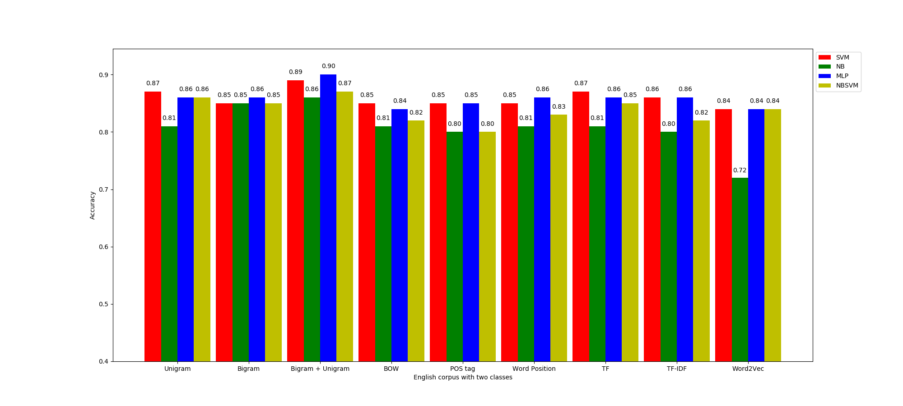
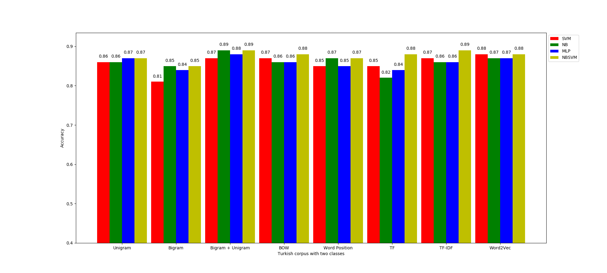

# Sentiment-Text-Analysis-using-Machine-Learning-Techniques

## Project structure
- src/sentiment_analysis.py is the main file
- src/helper folder contains all helper functions (stemmer, lemma forms, pos tagger, stopwords for Serbian language)
- src/test folder contains unit tests for funcionalities in sentiment_analysis.py file
- src/data folder contains input data
- src/results contains accuracy score analysis

### Corpus representations
- There are four movie review corpuses
  - Serbian corpus: https://github.com/vukbatanovic/SerbMR (SerbMR-3C - csv format)
    - positive (841), negative (841) and neutral (841) reviews
  - Serbian corpus: https://github.com/vukbatanovic/SerbMR (SerbMR-2C - csv format)
    - positive (841) and negative (841) reviews
  - English corpus: http://www.cs.cornell.edu/people/pabo/movie-review-data/review_polarity.tar.gz
    - positive (1000) and negative (1000) reviews
  - Turkish corpus: src/data/HUMIRSentimentDatasets.csv (considered only movie reviews)
    - positive (4000) and negative (4000) reviews (random 8000 reviews out of ~53000)

- Corpuses are represented in different styles:
  - Bag of words (BOW) model
  - Unigram model
  - Bigram model
  - Bigram + unigram model
  - Part of speech (POS) model (except for Turkish corpus)
  - Word position in text model
  - Term frequency model (for BOW model)
  - Term frequency - inverse document frequency model (for BOW model)
  - Word to vector model

- Additional:
  - Corpuses are cleaned from punctuation and stopwords
  - Words are reduced to their root form (stemming/lemmatization)
  - For ngram models only punctuation cleaning is performed

### Machine learning techniques
- All models are trained and tested using two algorithms:
  - SVM (Support Vector Machine) algorithm
  - NB (Naive Bayes) algorithm
  - MLP (Multi Layer Perceptron)
- Before training:
  - Training and test dataset are scaled to range [0, 1]
  - 10-cross validation is implemented to estimate the fitting model and ML algorithm [optional]
  - Grid search option is implemented to find the best hyperparameters for every model
    ( + autofitting with best hyperparameters) [optional]

## Dependencies:
- Python 3.7.4 (64 bit) or above
- Libraries:
  - os
  - sys
  - logging
  - argparse
  - pandas
  - nltk
  - numpy
  - string
  - sklearn
  - statistics
  - cyrtranslit
  - gc
  - matplotlib
  - TurkishStemmer
  - gensim

## Usage:
- Run the code by typing: "python sentiment_analysis.py"
  - choose the corpus to be processed:
    - "python sentiment_analysis.py -s3" for Serbian corpus with three classes
    - "python sentiment_analysis.py -s2" for Serbian corpus with two classes
    - "python sentiment_analysis.py -e2" for English corpus with two classes
    - "python sentiment_analysis.py -t2" for Turkish corpus with two classes
  - set the logging level e.g. "python sentiment_analysis.py -l debug" ([critical, error, warning, info, debug])
  - set the percentage number for test data e.g. "python sentiment_analysis.py -t 30" ([0-100])
  - set the option for 10-cross validation e.g. "python sentiment_analysis.py -c"
  - set the option for grid search e.g. "python sentiment_analysis.py -g"
  - type "python sentiment_analysis.py --help" to show all argument options
- Testing: go to src/test folder and type "python test_sentiment_analysis.py"

## Results:
### Serbian corpus with three classes

### Serbian corpus with two classes

### English corpus with two classes

### Turkish corpus with two classes

